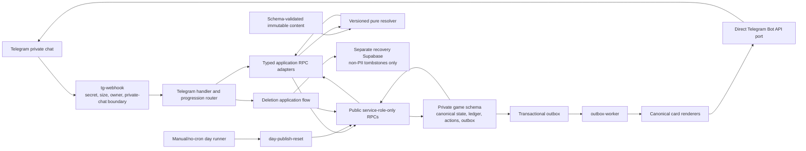

# Telegram Academy — As-Built Architecture

Status: canonical architecture map for the Phase 4A / Gate 4T.1 owner-only staging build.
App staging is deployed through application migration 017 with three active Edge Functions;
production remains untouched and Gate 4T.1 closeout is still in progress.

## 1. System in one paragraph

Telegram is a thin client. A secret-first Edge Function normalizes an update and routes it to typed
application adapters. Pure versioned TypeScript prepares deterministic encounter outcomes, while
service-role-only Postgres RPCs own identity, canonical state, atomic mutations, idempotency, XP,
progression and the transactional outbox. A separate worker renders the current canonical card and
sends or edits it through a direct Telegram Bot API port. There is no runtime LLM, no runtime image
generation, no direct Edge Function DML into the private `game` schema and currently no grammY or
`pg_cron` runtime dependency.

## 2. Runtime topology



## 3. Authority boundaries

| Boundary | Authoritative responsibility | Must not do |
|---|---|---|
| `content/` | Narrative scenes, clues, choices and immutable dungeon structure validated by schema | Store mechanical thresholds, decide outcomes or contain player data |
| `_shared/domain/` | Pure versioned party/combat/stage resolution, canonical hashes and Kyiv cycle math | Read the database, call Telegram or mutate state |
| Postgres migrations/RPCs | Canonical state, locks, atomic progression, idempotency, XP ledger, deletion fences and outbox transitions | Render Telegram text or call external services |
| `_shared/application/` | One typed adapter per RPC and orchestration across ports | Issue direct DML into `game` or recompute authoritative state |
| `_shared/progression/` | Validate server projections and expose the small starter catalog/contracts | Invent player power independently of Postgres |
| `_shared/render/` | Convert canonical views into bounded Telegram cards and buttons | Award XP, resolve combat or persist decisions |
| `_shared/telegram/` | Normalize updates, verify opaque callbacks, route commands/profile actions and abstract Telegram transport | Trust callback payloads as state or bypass application ports |
| Edge Functions | HTTP boundaries for webhook, internal worker and day lifecycle | Contain long-lived game rules or repository secrets |
| `recovery-control/` | Separate non-PII deletion tombstones and replay protection | Store Telegram identifiers, usernames, messages or gameplay data |

The important split is not “all logic lives in SQL.” It is:

- pure deterministic calculation lives in a versioned TypeScript resolver;
- every authoritative state transition lives in a service-only SQL RPC;
- TypeScript adapters connect those two boundaries and external transports without direct table
  access.

## 4. Main runtime flows

### 4.1 Telegram ingress

1. `tg-webhook` verifies `TELEGRAM_WEBHOOK_SECRET` before parsing the body.
2. It enforces a 64 KiB limit, normalizes the update and applies the current owner/private-chat
   allowlist before privileged adapters can be constructed.
3. The handler maps commands and opaque callbacks to the application layer.
4. Generic HTTP responses never expose identifiers or secret values.

The owner allowlist is a private staging boundary, not the future public authorization model.

### 4.2 Encounter choice

1. The server reads the immutable content version and the run/loadout snapshot.
2. The registered resolver prepares a deterministic resolution and canonical SHA-256 hash.
3. `prepare_action_v3` records the expected run state, actor-bound opaque callback and prepared
   resolution.
4. `resolve_choice_v3` validates actor, context, update and state versions, applies the result once,
   writes the XP/result records, may create the bounded tutorial discovery, and enqueues the
   canonical render in one transaction.
5. Exact retries are cached; stale or conflicting callbacks cannot duplicate rewards.

### 4.3 Profile progression

`player_home_v1` is the canonical projection for stats, equipment, rings, tutorial state and pending
offers. `resolve_player_action_v2` owns stat spending, item accept/discard, starter-ring choice and
ring mastery. A new `profile_version` requests at most one profile-bound card edit through
`request_profile_run_render_v1`; a current run card does not create redundant edits.

### 4.4 Delivery

Gameplay transactions write render intent to `game.outbox_messages`. `outbox-worker` leases work,
rechecks deletion/card/state ownership, renders from fresh canonical views, authorizes a bounded
transport attempt and then sends or edits through `TelegramPort`. New-send ambiguity becomes
`delivery_unknown` and requires incident-bound operator reconciliation; the worker never blindly
resends it.

### 4.5 Day lifecycle and deletion

The current owner-smoke uses a local runner: publish one fallback day, then poll the worker. The
runner is active only for the explicitly authorized owner-only staging session. There is
no scheduled production cron yet. Identity deletion follows `begin → external non-PII tombstone →
finalize`; the recovery database is a distinct trust and restore boundary.

## 5. Repository map

| Path | What belongs here |
|---|---|
| `content/schemas/` | Versioned content JSON schemas |
| `content/fallback/` | Reviewed immutable fallback days; `case-001/day-01.json` is locked |
| `supabase/migrations/` | Forward-only application schema/RPC history and checksum manifest |
| `supabase/functions/_shared/contracts/` | Versioned content, domain and generated database wire contracts |
| `supabase/functions/_shared/domain/` | Pure deterministic mechanics |
| `supabase/functions/_shared/application/` | Typed use cases and RPC ports |
| `supabase/functions/_shared/progression/` | Starter-build contracts and server projection parsing |
| `supabase/functions/_shared/render/` | Telegram card composition |
| `supabase/functions/_shared/telegram/` | Update, security, routing, callbacks and transport ports |
| `supabase/functions/_shared/infrastructure/` | Supabase, Telegram, clock, recovery and redaction adapters |
| `supabase/functions/{tg-webhook,outbox-worker,day-publish-reset}/` | Deployable HTTP entry points |
| `recovery-control/` | Separate deletion-tombstone schema |
| `scripts/db/` | Local reset, seed, checksums, reconciliation and upgrade verification |
| `scripts/staging/` | Offline-first staging policy, preflight and bounded owner runner |
| `tests/{unit,property,integration,e2e}/` | Boundary-to-full-loop evidence |
| `docs/checkpoints/` | Immutable phase evidence; not a replacement for current state |
| `PROJECT_STATE.md`, `TASKS.md`, `DECISIONS.md` | Current truth, active work and decisions |

## 6. Where to make a change

| Desired change | Start here | Required discipline |
|---|---|---|
| New story/day/teacher encounter | New file under `content/fallback/` plus schema/content tests | Never edit locked day 01 silently; no numeric thresholds in prose content |
| Combat/check formula | New resolver version under `_shared/domain/resolvers/` | Preserve V1/golden replay; add deterministic and balance evidence |
| Stat, XP, item or ring economy | New forward migration/config version and server projection | Do not calculate a second truth in rendering code |
| New persistent progression feature | New migration `018+`, versioned RPC, generated type, application adapter | Existing migrations 001–017 are immutable after the discovery C1 checkpoint |
| Telegram wording/layout | `_shared/render/` | Keep Telegram limits and canonical one-card UX |
| Command or callback route | `_shared/telegram/handler.ts` or `progression-router.ts` | Callback stays opaque, actor/message/version-bound and ≤64 bytes |
| Telegram API behavior | `telegram/port.ts` and `telegram/http.ts` | Preserve fake port and delivery-unknown semantics |
| Webhook authorization | `tg-webhook/index.ts`, update/security/allowlist modules | Reject before constructing privileged adapters |
| Background delivery/day operation | `outbox-worker`, `day-publish-reset`, `scripts/staging/` | Keep internal-secret and remote approval boundaries |
| Account deletion/recovery | deletion application adapters, recovery adapter and `recovery-control/` | Never copy Telegram PII into recovery |
| Future LLM generation | A separate offline content pipeline | LLM may narrate; schema/rules/lore validators and code decide publish/outcome |

## 7. Locked invariants

- Application migrations 001–017 and recovery migrations 001–002 are checksum-pinned. Correct them
  only with a new forward migration; the next application number is `018`.
- Resolver V1, its config and golden replay are immutable unless a deliberate new resolver version
  is approved.
- The fallback day 01 is re-locked after its approved balance amendment.
- The `game` schema is private; API roles have no direct table access and Edge code uses RPC only.
- Active-run mechanics use immutable content/config/loadout snapshots; later tuning does not rewrite
  an in-progress run.
- XP is append-only ledger-backed and daily capped. A retry must not duplicate any effect.
- Telegram delivery is outbox-driven. Unknown new-send delivery is never auto-retried.
- `.env`, bot tokens, service keys and real Telegram identifiers never enter Git, logs, content or
  chat.

## 8. Verification map

```powershell
# Fast source/type/unit/property gate
npm run verify

# Complete local Phase 4 regression; starts and stops local Supabase
npm run verify:phase4a

# Focused DB paths while the local stack is running
npm run test:db:phase4a
npm run test:db:phase4t0
npm run test:db:upgrade017

# Offline staging policy; real refs must come from approved non-repository input
npm run staging:preflight -- --staging --project-ref <APP_REF> --recovery-project-ref <RECOVERY_REF>
```

The complete verifier covers clean resets, upgrades from migrations 013 and 014, pgTAP, integration,
E2E Telegram flows, delivery faults, deletion restore/replay, callback load, balance, reconciliation,
lint and checksums.

## 9. Current extension order

1. Complete owner acceptance of discovery C1 in the live owner-only staging runner.
2. Finish the isolated deletion/recovery/reconciliation drill and Gate 4T.1 closeout.
3. Implement only the smallest content/progression changes justified by the recorded play evidence.
4. Run the deferred 5–10-person core-loop validation before expanding into Phase 5+ systems.

This ordering deliberately protects the project from building years of progression before proving
that the first two playable days are enjoyable.
