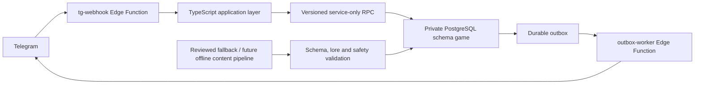

# RINGS — Telegram RPG про Академію магічних кілець

Портфоліо-проєкт текстової RPG, у якій гравець стає учнем Академії, щодня проходить
10-етапну експедицію, розвиває характеристики, спорядження та магічні кільця. Гра працює
через Telegram-бота, а механічний результат кожного вибору визначає сервер, а не LLM.

> Статус: активна розробка MVP. Приватний owner-only staging уже працював у реальному
> Telegram; поточні зміни перевірені локально. Production і зовнішнє тестування не увімкнені.

## Як виглядає ігровий день

1. Учень відкриває експедицію Академії та бачить сцену, спостереження викладача і кілька
   можливих дій.
2. Сервер зіставляє обраний підхід із характеристикою героя, внеском напарника та порогом
   етапу. Влучний підхід полегшує перевірку, ризикований ускладнює її.
3. Результат одразу пояснює використані числа, зміну HP і отриманий XP. У ранньому навчанні
   між етапами може з’явитися предмет, який треба відразу вдягнути або викинути.
4. Кнопка `Меню` дозволяє без втрати прогресу відкрити героя, Академію чи допомогу, а потім
   повернутися саме до поточного етапу або незавершеного вибору предмета.
5. Між експедиціями гравець витрачає XP на характеристики й майстерність кільця, підбирає
   спорядження та готує сильнішу збірку для глибших етапів.

## Що вже реалізовано

- Два навчальні дні з викладачем, зрозумілими підказками та одноразовим порятунком.
- Щоденна експедиція з 10 етапів, мінібосом на етапі 5 і фінальним босом на етапі 10.
- Вибір підходу до сцени: влучна дія знижує вимогу перевірки, ризикована підвищує її,
  пастка і нейтральний шлях мають окремі наслідки.
- Фізична й магічна сила, спритність, живучість, захист, HP і вільний досвід для розвитку.
- Три слоти спорядження без інвентарю: нову річ треба одразу вдягнути або викинути.
- Захищені знахідки між ранніми етапами навчання: шанс залежить від результату, а на
  третьому етапі діє гарантія. Прийнятий предмет впливає лише на наступний етап.
- Чотири стартові стилі магічних кілець і окреме тренування майстерності кільця.
- Кабінет героя з прозорим розкладом характеристик, предметів, кільця та вартості розвитку.
- Стабільне меню під час експедиції: квестові варіанти лишаються на місці, а повернення
  відновлює канонічний етап або незавершену знахідку.
- Серверне збереження, відновлення після перезапуску, захищені Telegram callbacks,
  ідемпотентні команди, outbox-доставка та видалення Telegram-зв’язку.

## Архітектура



Ключові межі:

- Pure TypeScript resolver детерміновано рахує outcome, шкоду, лікування та XP.
- SQL RPC атомарно змінюють канонічний стан; Edge Functions не пишуть напряму в приватні
  таблиці `game`.
- Telegram-картка є проєкцією серверного стану. Callback прив’язаний до гравця, повідомлення,
  версії стану й HMAC-контексту.
- LLM не бере участі у runtime-рішенні. У майбутньому він може створювати контент лише
  офлайн, до публікації та після валідації.

Детальна карта компонентів і правил зміни коду: [ARCHITECTURE.md](ARCHITECTURE.md).

## Технології

- TypeScript і Deno
- Telegram Bot API без стороннього bot framework
- Supabase Edge Functions
- PostgreSQL, приватна схема, versioned RPC та pgTAP
- Docker Desktop для локальної Supabase
- Unit, property, integration, concurrency та end-to-end Telegram-тести

## Локальний запуск

Потрібні Node.js 20+ і запущений Docker Desktop.

```powershell
npm ci
npm run verify
npm run db:start
npm run db:reset
```

Для повної локальної перевірки попередніх фаз:

```powershell
npm run verify:phase4a
```

Локальний Supabase має залишатися доступним лише через loopback або у довіреній приватній
мережі із синтетичними даними. Точні версії, команди та відновлення після інцидентів описані
у [local development runbook](docs/runbooks/local-development.md).

## Перевірки якості

`npm run verify` виконує format-check, lint, type-check, unit і property tests. Окремі DB-gates
перевіряють чисте застосування міграцій, pgTAP, upgrade paths, атомарність, конкурентні виклики,
Telegram E2E, доставку, privacy/deletion, баланс і SHA-256 міграцій.

Поточна фаза знахідок перевірена на чистій локальній базі міграціями 001–017, окремими
accept/discard integration-сценаріями та двома повними дводенними Telegram E2E-проходженнями.

## Документація

- [Канонічна специфіка гри](docs/specs/2026-07-12-game-design-v1.1.md)
- [Master implementation plan](docs/superpowers/plans/2026-07-12-telegram-academy-mvp.md)
- [Поточний стан](PROJECT_STATE.md) і [активні задачі](TASKS.md)
- [Лор-контекст](docs/lore/LORE_CONTEXT.md)
- [Приватний owner-smoke runbook](docs/runbooks/private-owner-smoke.md)

## Безпека й приватність

Секрети, Telegram identifiers, токени та локальні `.env` не повинні потрапляти до Git.
Реальні Telegram-скріншоти також не входять до репозиторію. Перед remote staging діє окремий
fail-closed preflight, а webhook допускає лише підтвердженого власника.

## Права

Код оприлюднюється як портфоліо автора. Проєкт має статус `UNLICENSED`: копіювання,
розповсюдження або комерційне використання не дозволені без окремої згоди автора.
