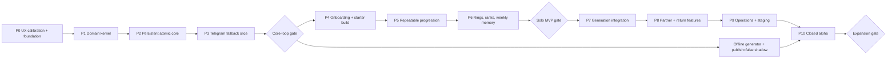

# Telegram Academy MVP Implementation Plan

> **For agentic workers:** REQUIRED SUB-SKILL: Use `superpowers:subagent-driven-development` (recommended) or `superpowers:executing-plans` to implement this plan phase-by-phase. Кожна фаза перед стартом отримує окремий детальний TDD-план із checkbox-кроками.

**Статус:** approved 2026-07-12; Inline execution із checkpoint fixes (ADR 034)  
**Джерело вимог:** `docs/specs/2026-07-12-game-design-v1.1.md`  
**Goal:** побудувати Telegram-гру за затвердженою v1.1 від порожнього репозиторію до безпечної закритої alpha на 10–20 зовнішніх гравців.

**Architecture:** Deno-first TypeScript на Supabase Edge Functions; grammY відповідає лише за Telegram transport і rendering, чистий TypeScript domain — за детерміновані розрахунки, Postgres — за канонічний стан і атомарні мутації. Розробка йде вертикальними fallback-first зрізами: спочатку доводиться цікавість 10-етапного core loop, потім solo-прогресія, тижнева пам’ять, генератор, напарник та operations.

**Tech Stack:** TypeScript/Deno, grammY, Supabase Postgres + Edge Functions + pg_cron, SQL migrations/pgTAP, Deno test, Claude API через adapter лише для pre-runtime content generation, image API лише за feature flag.

## Global Constraints

- Гравець — власний учень Академії; гра самодостатня без знання книг.
- Макс, чорне кільце й магія плоті не входять у гру.
- Один спільний 10-етапний данж дня; немає персонального scaling.
- Резолюція детермінована; випадковий roll не визначає успіх choice.
- Звичайного рівня персонажа й інвентарю немає.
- Чотири стати: фізична сила, магічна сила, спритність, живучість.
- Три item slots; одна або дві active rings; усі кільця стартують синіми.
- Runtime ніколи не викликає LLM.
- Усі XP-мутації проходять append-only ledger; денний cap — 150 XP.
- Усі Telegram actions мають ownership, opaque action token, idempotency та state-version guard.
- DB commit і Telegram delivery розділені transactional outbox.
- JSONB дозволений лише для immutable content/weekly manifest, snapshots і validated offers.
- Новий cycle відкривається о 09:00 `Europe/Kyiv`; grace — дві години.
- Ніяких production deploy, remote migration або webhook registration без окремого approval.
- `CLAUDE.md`, v1.0, lore/research і затверджена v1.1 не змінюються під час реалізації фази без окремого рішення.

---

## 1. Стратегія доставки

Це master-plan, а не один гігантський coding batch. Перед кожною фазою створюється окремий файл у `docs/superpowers/plans/` з точними red-green кроками, кодом, командами й очікуваним результатом. Наступна фаза не починається, доки попередня не має перевіреного demo та закритого gate.

Три контрольні продукти:

1. **Core-loop proof після Phase 3:** один повний fallback-данж у Telegram, без meta-систем.
2. **Solo MVP після Phase 6:** onboarding, прогресія, кільця, ранги й тижнева пам’ять на handcrafted content.
3. **Full closed-alpha MVP після Phase 10:** generation shadow, partner, reminders, privacy, safety й operations.

Якщо core-loop не створює бажання повернутися, не додаються нові meta-системи. Спочатку змінюються довжина карток/прогону, clue quality, threshold curve або cadence нагород.



Одразу після Core-loop gate окремий offline track реалізує schema/blueprint/writer/validators без DB migration і live publishing та запускає 30-денний `publish=false` shadow. Phase 4–6 ідуть паралельно з цим календарним gate. Phase 7 інтегрує вже перевірений pipeline з weekly runtime; migrations і deploy лишаються строго послідовними.

Effort bands для планування: **S** — 1–2, **M** — 3–5, **L** — 6–10 focused solo days без очікування зовнішніх gates. Це не дедлайни; після Phase 3 оцінка переглядається за фактичним velocity.

---

## 2. Початкові припущення

- Перший масштаб — десятки людей, одна українська локаль.
- Є окремі local, staging і production Supabase environments; production створюється або лінкується лише на deployment gate. Для closed alpha recovery-control store — окремий маленький Supabase project із єдиною private tombstone table/API; він зберігає лише surrogate account ID і не відновлюється разом з app project.
- Node.js 20+ використовується тільки для pinned Supabase CLI; runtime гри — Deno.
- Docker або сумісний runtime потрібен для локального Supabase.
- Текстовий provider за поточним `PROJECT_STATE.md` — Claude API через `LlmWriterPort`; model ID живе у versioned generation config.
- Image provider обирається у Phase 7; відсутність cover ніколи не блокує день.
- Telegram bot для local/staging може мати тимчасовий приватний username; публічна назва не блокує код.
- Усі prototype balance values з v1.1 лишаються config values до симуляції та playtest.

---

## 3. Цільова структура файлів

```text
package.json
package-lock.json
deno.json
deno.lock
.editorconfig
.gitignore
.github/workflows/ci.yml

content/
  schemas/
    dungeon-v1.schema.json
    weekly-manifest-v1.schema.json
  policies/
    lore-policy-v1.json
    safety-policy-v1.json
  fallback/
    case-001/day-01.json ... day-07.json
  reviewed/
    alpha-week-01/ ... alpha-week-04/

prototypes/
  concierge/
    dungeon-001.md
    session-log.csv
    README.md

recovery-control/
  supabase/config.toml
  supabase/migrations/202607120001_identity_deletion_tombstones.sql

scripts/
  import-fallback-content.ts
  simulate-balance.ts
  simulate-economy.ts
  run-content-shadow.ts
  load-callbacks.ts
  install-cron.ts
  verify-reconciliation.ts
  verify-migration-checksums.ts
  replay-identity-deletions.ts

supabase/
  config.toml
  seed.sql
  migrations/
    checksums.sha256
    202607120001_foundation.sql
    202607120002_config_versions.sql
    202607120003_players_identity.sql
    202607120004_content_days_fallback.sql
    202607120005_xp_ledger.sql
    202607120006_runs_core.sql
    202607120007_actions_outbox_analytics.sql
    202607120008_core_commands.sql
    202607120009_tutorial_starter.sql
    202607120010_progression_items_rings.sql
    202607120011_weekly_rank_memory.sql
    202607120012_generation.sql
    202607120013_partnerships.sql
    202607120014_operations.sql
  tests/database/
    0001_security.test.sql
    0002_content_days.test.sql
    0003_runs_actions.test.sql
    0004_xp_ledger.test.sql
    0005_tutorial_starter.test.sql
    0006_progression.test.sql
    0007_weekly_rank.test.sql
    0008_generation.test.sql
    0009_partnerships.test.sql
    0010_operations.test.sql
  functions/
    _shared/
      contracts/
        commands.ts
        content.ts
        domain.ts
        views.ts
        database.types.ts
      domain/
        resolver-registry.ts
        resolvers/
          v1/
            resolver.ts
            combat.ts
            party.ts
        progression.ts
        rings.ts
        ranks.ts
        cycle.ts
      application/
        start-run.ts
        resolve-choice.ts
        resolve-offer.ts
        spend-xp.ts
        resume.ts
      infrastructure/
        env.ts
        supabase.ts
        logger.ts
        clock.ts
      telegram/
        bot.ts
        verify-webhook.ts
        callback-actions.ts
        delivery.ts
      render/
        onboarding.ts
        menu.ts
        stage-card.ts
        offer-card.ts
        hero-card.ts
        partner-card.ts
        summary.ts
      content/
        manifest.ts
        blueprint.ts
        writer-port.ts
        claude-writer.ts
        validate-schema.ts
        validate-code.ts
        validate-lore-safety.ts
        semantic-judge.ts
        fallback.ts
        cover.ts
    tg-webhook/index.ts
    outbox-worker/index.ts
    day-publish-reset/index.ts
    content-generate/index.ts
    broadcast-worker/index.ts
    reconciliation/index.ts
    admin-controls/index.ts

tests/
  unit/
  property/
  integration/
  concurrency/
  e2e/
  fixtures/
    telegram/
    content/
    replays/v1/
```

Принцип міграцій: expand-only; кожна таблиця одразу отримує constraints, indexes і default-deny grants. Після застосування у shared environment migration не можна редагувати, перейменовувати, reorder або повторно використовувати; виправлення — лише нова forward migration. `checksums.sha256` і CI перевіряють content/order, clean reset та upgrade path. Environment-specific cron jobs не записуються в schema migration: їх встановлює `scripts/install-cron.ts` після deploy endpoints і secrets.

---

## 4. Межі відповідальності й стабільні interfaces

### 4.1 Хто є authoritative

- **TypeScript domain:** deterministic choice/combat/support calculations, config interpretation, view-model construction, fast simulation.
- **Postgres:** state ownership, row locking, state version, unique constraints, XP cap/ledger, idempotency, offers, partner membership, quarantine, outbox.
- **LLM:** лише copy всередині вже готового blueprint.
- **Telegram:** лише transport; callback payload ніколи не містить trusted XP, damage, player ID або outcome.

Мутація не складається з кількох незалежних `supabase-js` writes. При створенні кнопки сервер зберігає `callback_actions`: hash opaque token, owner, run/stage/choice, bound state/resolver/content/config versions, canonical context hash і expiry. Telegram отримує лише token.

Для choice застосовується такий точний optimistic atomic protocol:

1. webhook формує `TelegramCallbackInput` із verified Telegram update; client не надсилає trusted `state_version`;
2. service-only `api.load_action_context` перевіряє token + Telegram actor і повертає server-derived `ResolvedActionContext`;
3. immutable resolver registry обирає модуль за pinned `resolverVersion`; pure resolver створює `ActionCommitV1`;
4. `api.commit_action` спочатку шукає cached result за `updateId` або logical action ID: **duplicate має пріоритет над stale** навіть після подальшого руху run;
5. якщо duplicate не знайдено, RPC без lock читає binding token, після чого блокує в глобальному порядку: усі involved `players` за UUID → `runs` за UUID → `reward_offers` → `item_instances/ring_instances` за UUID → `player_cycle_xp_earnings` → `callback_actions`;
6. після locks RPC повторно перевіряє duplicate, owner, unconsumed token, phase, bound state version, resolver/content/config IDs та `contextHash`;
7. tampered envelope або invalid owner дає `rejected`; changed phase/version дає `stale`; обидва результати мають **zero writes**, включно без `processed_actions` чи outbox;
8. лише `applied` за одну транзакцію записує stage result, змінює HP/status, додає ledger/cap/analytics/outbox, marks token consumed, stores exact `CommandResult` і збільшує run `state_version` рівно на 1;
9. будь-яка помилка відкочує всю транзакцію; lost HTTP response повертається через duplicate cached result;
10. specialized commands для offers/partnership/quarantine використовують той самий duplicate-first принцип і ту саму глобальну lock hierarchy.

Phase 2 не закривається, доки concurrency tests не доведуть цю модель. Якщо вона не проходить lost-response/stale-race tests, до feature work приймається окремий ADR і command переноситься у повністю authoritative SQL RPC; прямі multi-write мутації не дозволяються.

### 4.2 Базові TypeScript contracts

```ts
export type CommandDisposition =
  | "applied"
  | "duplicate"
  | "stale"
  | "rejected";

export interface TelegramCallbackInput {
  updateId: number;
  actionToken: string;
  telegramActorId: string;
}

export interface ResolvedActionContext {
  logicalActionId: string;
  playerId: string;
  runId: string;
  stageId: string;
  choiceId: string;
  boundStateVersion: number;
  resolverVersion: string;
  contentVersion: string;
  configVersion: string;
  contextHash: string;
}

export interface ActionCommitV1 {
  resolverVersion: string;
  contentVersion: string;
  configVersion: string;
  runId: string;
  stageId: string;
  choiceId: string;
  outcome: "success" | "neutral" | "failure";
  hpDelta: number;
  xpDelta: number;
  flagsWritten: readonly string[];
  explanationKey: string;
  resolutionHash: string;
}

export interface CommitActionEnvelopeV1 {
  updateId: number;
  logicalActionId: string;
  actionToken: string;
  telegramActorId: string;
  boundStateVersion: number;
  contextHash: string;
  resolution: ActionCommitV1;
}

export interface CommandResult {
  disposition: CommandDisposition;
  stateVersion: number;
  canonicalView: string;
  outboxIds: readonly string[];
  errorCode?: string;
}

export interface StageBlueprintV1 {
  id: string;
  index: number;
  choices: readonly ChoiceBlueprintV1[];
  neutralChoiceId: string;
  trapChoiceId?: string;
}

export interface ChoiceBlueprintV1 {
  id: string;
  kind: "check" | "neutral" | "trap";
  stat?: "physical" | "magical" | "agility" | "vitality";
  thresholdBand?: number;
  clueId: string;
}

export interface RunSnapshotV1 {
  runId: string;
  resolverVersion: string;
  contentVersion: string;
  configVersion: string;
  stateVersion: number;
  hp: number;
  maxHp: number;
  self: EffectiveStatsV1;
}

export interface EffectiveStatsV1 {
  physical: number;
  magical: number;
  agility: number;
  vitality: number;
  defense: number;
}

export interface PartySnapshotV1 {
  hp: number;
  maxHp: number;
  physical: number;
  magical: number;
  agility: number;
  defense: number;
}

export interface ResolveStageInput {
  run: RunSnapshotV1;
  party: PartySnapshotV1;
  stage: StageBlueprintV1;
  choiceId: string;
  config: GameConfigV1;
}

export interface StageResolution {
  outcome: "success" | "neutral" | "failure";
  hpDelta: number; // damage is negative; healing is positive
  xpDelta: number; // non-negative, cap-subject reward intent
  explanationKey: string;
  flagsWritten: readonly string[];
}

export interface ResolveBossInput extends ResolveStageInput {
  exchange: 1 | 2;
  bossHp: number;
}

export interface BossResolution extends StageResolution {
  bossHpDelta: number;
  terminal?: "victory" | "contained" | "defeated";
}

export interface GameConfigV1 {
  dailyXpCap: number;
  tacticalCounterBandDelta: number;
  vampStageCapRate: number;
  vampRunCapRate: number;
}

export interface PartySnapshotInput {
  self: EffectiveStatsV1;
  partner?: EffectiveStatsV1;
}

export interface RingRefundInput {
  investedXp: number;
  referenceDailyXp: number;
  maxLossActiveDays: number;
}

export interface DebriefInput {
  reachedStage: number;
  bossResult?: "victory" | "contained" | "defeated";
  failedStat?: keyof EffectiveStatsV1;
}

export interface NextGoal {
  kind: "stat" | "item" | "ring" | "tactic";
  textKey: string;
}
```

Seed config v1 використовує відповідно `150`, `−1`, `0.08`, `0.25` і refund horizon `30`; TypeScript лишає поля числовими, бо після simulation нова config version може змінити прототип без переписування старих runs.

Domain entry points:

```ts
resolveStage(input: ResolveStageInput): StageResolution
resolveBossExchange(input: ResolveBossInput): BossResolution
calculatePartySnapshot(input: PartySnapshotInput): PartySnapshot
nextStatPointCost(purchasedPoints: number): number
calculateRingRefund(input: RingRefundInput): number
buildNextGoal(input: DebriefInput): NextGoal
```

Кожен contract має version; active run фіксує `resolver_version`, `content_version` і `config_version`. `resolver-registry.ts` dispatch-ить exact immutable module на кшталт `resolvers/v1/`; модуль, уже referenced persisted run, не редагується. Нова поведінка створює `v2`, а golden replay/hash fixtures для всіх версій лишаються в CI. Deploy preflight перевіряє, що registry містить кожну version, referenced активними/аудитними runs; executable compatibility гарантується щонайменше два cycles плюс grace, а source/golden fixtures зберігаються довше для replay.

### 4.3 DB command boundaries

Service-only RPCs:

- `api.lookup_or_create_player`
- `api.start_run`
- `api.load_action_context`
- `api.commit_action`
- `api.resume_run`
- `api.abandon_run`
- `api.resolve_offer`
- `api.spend_xp`
- `api.choose_starter_ring`
- `api.replace_ring`
- `api.activate_partnership`
- `api.unlink_identity`
- `ops.tick_day`
- `ops.lease_outbox`
- `ops.reconcile_xp`
- `ops.quarantine_content`

Telegram callback data містить лише opaque `actionToken`; `boundStateVersion`, player/stage/choice semantics сервер завантажує зі збереженого action record. Verified `telegramActorId` використовується лише для owner check і не пишеться в application logs/analytics. `processed_actions` має окрему uniqueness для Telegram `update_id` та logical action token. Повторна доставка одного update і повторні кліки різних updates не можуть подвоїти outcome.

---

## 5. Test contract для кожної фази

Кожна feature task виконується red → green → refactor:

1. написати failing unit/pgTAP/integration test;
2. запустити точний test і побачити очікуваний fail;
3. додати мінімальну реалізацію;
4. повторити targeted test;
5. запустити phase suite;
6. зробити окремий commit після review.

Базові локальні команди після Phase 0:

```powershell
npm ci
npx supabase start
npx supabase db reset
npx supabase db lint
npx supabase test db
deno fmt --check
deno lint
deno task check
deno task test:unit
deno task test:integration
deno test --coverage=coverage tests/unit tests/property
deno coverage coverage --threshold=85
```

`deno task verify` об’єднує format, lint, check, unit/property і DB tests. Мережеві E2E та довгі simulations мають окремі tasks, щоб merge CI лишався швидким і не маскував flaky tests retries.

---

## 6. Phases

### Phase 0 — Concierge UX calibration і foundation

**Relative effort:** S  
**Demo:** один handcrafted 10-stage dungeon проходиться вручну в приватному Telegram; після цього valid local Supabase/grammY skeleton відповідає health check.

**Files:**

- Create: `prototypes/concierge/dungeon-001.md`
- Create: `prototypes/concierge/session-log.csv`
- Create: `prototypes/concierge/README.md`
- Create: `package.json`, `package-lock.json`, `deno.json`, `deno.lock`
- Create: `.editorconfig`, `.gitignore`, `.github/workflows/ci.yml`
- Create: `supabase/config.toml`, `supabase/seed.sql`
- Create: `supabase/functions/health/index.ts`
- Create: `docs/runbooks/local-development.md`
- Modify: `README.md`

**Tasks:**

1. Ініціалізувати наявну порожню `.git` через `git init`; не видаляти або замінювати її без окремого дозволу.
2. Провести concierge-сесію з 3–5 людьми: модератор надсилає картки, вручну рахує HP і не пояснює «правильну» кнопку.
3. Зафіксувати під анонімними participant IDs active time, first-choice time, незрозумілі clues, message fatigue та return intent; Telegram usernames у CSV не записувати.
4. Pin Node 20+, stable Supabase CLI у `package-lock.json`, Deno dependencies у `deno.lock`.
5. Виконати `npx supabase init`; створити Deno tasks і CI.
6. Prove grammY import та Edge Function compatibility на health endpoint без Telegram token.
7. Створити fake clock, fake Telegram adapter і redacting logger contracts.
8. Зафіксувати initial alpha defaults у `docs/runbooks/local-development.md`: expected peak 1 callback/s, load gate 10 callbacks/s протягом 10 хвилин, RTO ≤4 години, disaster RPO ≤24 години для закритої alpha, identity unlink негайно й deletion workflow ≤24 години. Зміна цих меж потребує review.

**Acceptance:**

- Перший meaningful choice у concierge test доступний за два повідомлення/натискання.
- Медіанний first choice ≤45 секунд; повний active run directionally ≤12 хвилин.
- Щонайменше 70% testers правильно пояснюють одну clue після outcome.
- `npx supabase start`, `npx supabase db reset`, `deno fmt --check`, `deno lint` і порожній `deno test` завершуються без помилки.
- Edge health function працює локально.
- У git немає token, local env, database dump або приватних Telegram даних.

**Stop condition:** якщо 10 етапів уже в ручному тесті відчуваються виснажливими, до Phase 1 змінюється presentation/length, а не додається progression.

**Commit:** `chore: initialize Deno Supabase project`

---

### Phase 1 — Deterministic domain kernel

**Relative effort:** M  
**Dependency:** Phase 0  
**Demo:** CLI програє один validated fallback dungeon від stage 1 до boss summary без DB і Telegram.

**Files:**

- Create: `content/schemas/dungeon-v1.schema.json`
- Create: `content/fallback/case-001/day-01.json`
- Create: `supabase/functions/_shared/contracts/content.ts`
- Create: `supabase/functions/_shared/contracts/domain.ts`
- Create: `supabase/functions/_shared/domain/resolver-registry.ts`
- Create: `supabase/functions/_shared/domain/resolvers/v1/resolver.ts`
- Create: `supabase/functions/_shared/domain/resolvers/v1/combat.ts`
- Create: `supabase/functions/_shared/domain/resolvers/v1/party.ts`
- Create: `supabase/functions/_shared/domain/cycle.ts`
- Create: `scripts/simulate-balance.ts`
- Create: `tests/unit/resolver_test.ts`
- Create: `tests/property/determinism_test.ts`
- Create: `tests/property/combat_invariants_test.ts`
- Create: `tests/fixtures/replays/v1/*.json`
- Create: `tests/unit/resolver_golden_replay_test.ts`

**Scope:**

- exact 10-stage schema й quotas;
- success/neutral/failure, fixed thresholds, trap cap;
- HP, defense, heal, vamp ordering та caps;
- stage-5 mini-boss;
- exact two-exchange boss blueprint з early `HP=0` terminal;
- victory/contained/defeated і deterministic double-zero rule;
- solo/teacher/partner snapshot interfaces;
- prototype XP distribution як output, без persistence;
- versioned clock/cycle boundary helper для `Europe/Kyiv`.

**Acceptance:**

- Однаковий input дає byte-identical resolution і hash у 1000 repeats.
- Registry dispatch за `resolver_version` відтворює golden result/hash; зміна будь-якого v1 result ламає CI й вимагає нового resolver module/version.
- Runtime path не імпортує RNG і не викликає network.
- Fixtures покривають success, neutral, failure, trap, HP=0, victory, contained і double-zero.
- Stage schema відхиляє не 10 stages, відсутній neutral, trap на stages 1–2 і неправильну boss structure.
- Property tests доводять: HP не вище max, heal не resurrect, vamp використовує лише owner non-overkill damage, first boss exchange не дає victory.
- Simulation показує legal solo path до stage 10 для майбутнього розвиненого build і зберігає можливість раннього гравця зупинитися близько stage 5.

**Not in phase:** DB, Telegram, items, rings, generator, reminders.

**Commit:** `feat: add deterministic dungeon kernel`

---

### Phase 2 — Persistent atomic core

**Relative effort:** L  
**Dependency:** Phase 1  
**Demo:** локальна DB створює player/day/run, атомарно застосовує choice, записує XP/outbox і відтворює state після restart.

**Files:**

- Create migrations `202607120001_foundation.sql` … `202607120008_core_commands.sql`
- Create pgTAP tests `0001_security.test.sql` … `0004_xp_ledger.test.sql`
- Create: `supabase/functions/_shared/contracts/database.types.ts`
- Create: `supabase/functions/_shared/infrastructure/supabase.ts`
- Create: `supabase/functions/_shared/application/start-run.ts`
- Create: `supabase/functions/_shared/application/resolve-choice.ts`
- Create: `supabase/functions/_shared/application/resume.ts`
- Create: `scripts/verify-reconciliation.ts`
- Create: `scripts/verify-migration-checksums.ts`
- Create: `scripts/replay-identity-deletions.ts`
- Create: `supabase/migrations/checksums.sha256`
- Create: `supabase/functions/_shared/infrastructure/deletion-sink.ts`
- Create: `supabase/functions/_shared/application/delete-identity.ts`
- Create: `recovery-control/supabase/config.toml`
- Create: `recovery-control/supabase/migrations/202607120001_identity_deletion_tombstones.sql`
- Create: `tests/integration/core_commands_test.ts`
- Create: `tests/concurrency/duplicate_choice_test.ts`
- Create: `tests/concurrency/commit_linearization_test.ts`
- Create: `tests/e2e/restore_identity_deletion_test.ts`

**Migration order:**

1. schemas/enums/default-deny privileges;
2. config versions/feature flags;
3. surrogate players/deletable identity links;
4. immutable content versions/dungeon days/fallback;
5. XP account/append-only ledger/cycle earnings;
6. runs/self snapshots/loadout versions/stage results;
7. action tokens/processed actions/outbox/typed analytics;
8. service-only command RPCs.

Minimal restore-safe deletion існує вже тут. `IdentityDeletionSink` спочатку idempotently записує лише `surrogate_account_id + deletion_id + timestamp` у recovery-control store, який не відновлюється разом з app DB; Telegram ID туди не потрапляє. Потім primary transaction видаляє `identity_links` і personal fields. Completion повертається лише після обох кроків. Якщо sink недоступний, account негайно блокує подальші game actions як `deletion_pending`, але workflow не заявляє completion і повторюється до 24-hour SLA. Будь-який app restore проходить ізольовано, replay-ить tombstones і лише потім може приймати Telegram traffic.

**Acceptance:**

- Anonymous/authenticated roles не читають і не мутують game tables/RPCs.
- Один player має максимум один nonterminal run.
- 100 copies одного callback створюють один result, один ledger delta й один logical outbox card.
- Два concurrent choices одного version дають `applied + stale`, ніколи два `applied`.
- Tampered `contextHash`, actor, run/stage/choice або version дає `rejected` із zero writes.
- Уже processed logical token з іншим `updateId` і duplicate після подальшого state advance повертають exact cached result до stale check.
- Дві різні legal actions одного bound version дають рівно один `applied`; `state_version` збільшується рівно на 1.
- Lost HTTP response після commit відновлює committed state без повторної XP.
- Concurrent cap-subject rewards не перевищують 150 XP/cycle.
- Ledger append-only; cached balance і cycle earnings дорівнюють ledger sum.
- Resolver читає лише pinned snapshot/content/config; live profile mutation не змінює run.
- `/delete_me` DB contract видаляє identity link; retained ledger не дозволяє відновити Telegram ID.
- Completed deletion має external surrogate tombstone; isolated backup restore + replay не відновлює deleted Telegram identity.
- Migration checksum/order незмінні; CI проходить clean reset і upgrade з попереднього phase snapshot. Уже shared-applied migration не редагується.
- `npx supabase db reset`, `npx supabase test db`, integration і concurrency suites проходять.

**Approval gate:** перед застосуванням першої migration поза local потрібен окремий review/approval.

**Commit:** `feat: add atomic run state and xp ledger`

---

### Phase 3 — Telegram fallback-first vertical slice

**Relative effort:** M  
**Dependency:** Phase 2  
**Demo:** `/start → один persisted fallback run → stage-5 mini-boss → stage-10 boss → summary`, включно з resume після interruption.

**Files:**

- Create: `supabase/functions/tg-webhook/index.ts`
- Create: `supabase/functions/outbox-worker/index.ts`
- Create: `supabase/functions/day-publish-reset/index.ts`
- Create: `supabase/functions/_shared/telegram/*`
- Create: `supabase/functions/_shared/render/onboarding.ts`
- Create: `supabase/functions/_shared/render/menu.ts`
- Create: `supabase/functions/_shared/render/stage-card.ts`
- Create: `supabase/functions/_shared/render/summary.ts`
- Create: `tests/fixtures/telegram/*.json`
- Create: `tests/e2e/fallback_solo_test.ts`
- Create: `tests/e2e/grace_expiry_test.ts`

**Scope:**

- Telegram secret-header verification; `verify_jwt=false` лише для public webhook;
- surrogate identity lookup, `/start`, intro, Expedition button;
- opaque callback tokens;
- one editable stage card, boss exchange cards, summary;
- resume/stale action behavior;
- outbox lease/send/edit states including `delivery_unknown`;
- local day tick, one run/cycle, 09:00 Kyiv, 2-hour grace, expiry/abandon;
- `/privacy` і `/delete_me` до залучення будь-яких зовнішніх testers;
- staging recovery-control deletion sink і isolated restore/replay smoke до першого tester invite;
- XP заробляється й показується, але spending UI ще закритий.

**Acceptance:**

- Перший choice — максимум два messages і два taps.
- Повторний/stale callback не змінює стан і відкриває canonical card.
- Один stage не породжує message spray: choice, outcome, HP, XP і clue лишаються в одній картці.
- Telegram 429/500/timeout і `delivery_unknown` не подвоюють new-send.
- Resume працює після process restart і lost response.
- 23/25-hour DST cycles та grace перевірені fake clock tests.
- Local callback acknowledgement p95 <2 с під 10× очікуваного alpha peak у `scripts/load-callbacks.ts`.

**Core-loop gate:**

- privacy notice доступний; один test identity успішно deleted, app DB restored в ізоляції й tombstone replay не дозволив identity з’явитися знову;
- 5–10 testers проходять fixed content без усного пояснення;
- ≥80% роблять meaningful first choice;
- ≥70% пояснюють clue/stat;
- median run ≤12 хв, p90 ≤20 хв;
- ≥70% ставлять 4–5/5 на «повернувся/повернулася б завтра».

Якщо gate не пройдений, Phase 4 не стартує.

**Commit:** `feat: deliver fallback dungeon in Telegram`

---

### Parallel Track G — Offline generation і early shadow

**Starts after:** Core-loop gate  
**Runs alongside:** Phases 4–6  
**Constraint:** no DB migration, Edge deploy або live publish.

**Files:**

- Create: `content/schemas/weekly-manifest-v1.schema.json`
- Create: `content/policies/lore-policy-v1.json`
- Create: `content/policies/safety-policy-v1.json`
- Create: `supabase/functions/_shared/content/manifest.ts`
- Create: `supabase/functions/_shared/content/blueprint.ts`
- Create: `supabase/functions/_shared/content/writer-port.ts`
- Create: `supabase/functions/_shared/content/claude-writer.ts`
- Create: `supabase/functions/_shared/content/validate-schema.ts`
- Create: `supabase/functions/_shared/content/validate-code.ts`
- Create: `supabase/functions/_shared/content/validate-lore-safety.ts`
- Create: `supabase/functions/_shared/content/semantic-judge.ts`
- Create: `supabase/functions/_shared/content/fallback.ts`
- Create: `scripts/run-content-shadow.ts`
- Create: `tests/unit/content_validators_test.ts`
- Create: `tests/integration/offline_generation_test.ts`

Pure offline pipeline використовує production dungeon/weekly schemas, але пише лише shadow artifacts. Щойно schema/code/lore/safety gates стабільні, запускається 30-day `publish=false` shadow; Phases 4–6 не чекають його завершення. Якщо approved schema version змінюється несумісно, shadow window для нової version починається заново й це явно фіксується.

**Acceptance:** LLM не може задавати mechanics; invalid payload не проходить validators; кожен failure має classified fallback result; runtime gameplay imports graph не містить writer adapter.

---

### Phase 4 — Onboarding і starter build

**Relative effort:** M  
**Dependency:** Core-loop gate  
**Demo:** новий player завершує два accelerated tutorial runs, купує перший stat, приймає tutorial item і обирає starter ring.

**Files:**

- Create: `supabase/migrations/202607120009_tutorial_starter.sql`
- Create: `supabase/tests/database/0005_tutorial_starter.test.sql`
- Create: `supabase/functions/_shared/domain/progression.ts`
- Create: `supabase/functions/_shared/domain/rings.ts`
- Create: `supabase/functions/_shared/application/spend-xp.ts`
- Create: `supabase/functions/_shared/application/resolve-offer.ts`
- Create: `supabase/functions/_shared/render/hero-card.ts`
- Create: `supabase/functions/_shared/render/offer-card.ts`
- Create: `tests/e2e/tutorial_test.ts`

**Scope:**

- tutorial progress `0/2 → 1/2 → 2/2`;
- teacher snapshot, contextual teaching й one-time rescue;
- completion conditions including HP=0/expiry after three resolved stages;
- first XP purchase after run 1;
- guaranteed armor/talisman offer after run 2;
- four equal-budget starter rings;
- compatible base weapon/focus;
- menu grows from two to four buttons;
- random item/ring offers disabled in tutorial run 1.

**Acceptance:**

- Start-only та explicit abandon не рахують tutorial.
- Rescue гарантує щонайменше три meaningful choices.
- Run 2 дає tutorial item і starter ring після будь-якого valid terminal.
- Stat/ring spend діє лише з наступного run.
- Порожні або далекі systems не показуються locked tabs.
- Усі tutorial transitions idempotent.

**Commit:** `feat: add tutorial and starter build`

---

### Phase 5 — Repeatable solo progression

**Relative effort:** L  
**Dependency:** Phase 4  
**Demo:** accelerated 3–5 cycles показують, що stat/item/ring improvement змінює fixed outcome або reachable depth.

**Files:**

- Create: `supabase/migrations/202607120010_progression_items_rings.sql`
- Create: `supabase/tests/database/0006_progression.test.sql`
- Modify: progression/ring/application/render modules
- Create: `scripts/simulate-economy.ts`
- Create: `tests/property/progression_invariants_test.ts`
- Create: `tests/concurrency/offers_refunds_test.ts`
- Create: `tests/e2e/solo_progression_test.ts`

**Scope:**

- XP spend, quadratic stat cost і per-stat cap;
- три item slots, five rarities, deterministic budget/single property;
- smart loot/protected RNG лише після mechanical result;
- one pre-boss + one boss item offer;
- equip/discard/cutoff і mid-run loadout version;
- ring mastery/colors, rarity/domain/technique, compatibility;
- ring offer/defer/expiry/scheduled replacement;
- pinned refund formula та no-active-run replacement;
- post-run queue item → optional ring → summary;
- concrete next-development goal.

**Acceptance:**

- Близько 60% денного XP доступні до stage 5; cap не перевищується.
- Mid-run item впливає лише на наступний unresolved stage й зберігає HP ratio при max-HP change.
- Spending і ring replacement не змінюють active snapshot.
- Refund застосовується рівно один раз за pinned policy.
- Не існує inventory UI або прихованого складу.
- Legal physical, magical, defense/heal і hybrid builds лишаються життєздатними у five-year simulation.
- Розвинений build детерміновано перетворює принаймні один раніше failed check на success/deeper progress.

**Solo progression gate:** balance simulation, offer concurrency suite та 3–5 accelerated play cycles пройдені до rank/weekly layer.

**Commit:** `feat: add repeatable solo progression`

---

### Phase 6 — Academy ranks і weekly memory

**Relative effort:** L  
**Dependency:** Phase 5  
**Demo:** cohort проходить/пропускає handcrafted seven-day Case; accelerated player отримує Practitioner і один breakthrough.

**Files:**

- Create: `supabase/migrations/202607120011_weekly_rank_memory.sql`
- Create: `supabase/tests/database/0007_weekly_rank.test.sql`
- Create: `supabase/functions/_shared/domain/ranks.ts`
- Create: `content/fallback/case-001/day-02.json` … `day-07.json`
- Create: `tests/e2e/ranks_breakthrough_test.ts`
- Create: `tests/e2e/weekly_case_echo_test.ts`

**Scope:**

- Novice, Apprentice, Practitioner, Senior Practitioner;
- personal stage-5/stage-10 attestations using self-only overlay;
- boss credits, second ring slot й useful Practitioner offer;
- one designated 100%-mastery breakthrough per boss victory;
- weekly manifest, daily recap, day-7 finale;
- max two important same-run choices/payoffs;
- one active next-played-run echo;
- Chronicle й cosmetic 12-run style;
- missed-finale catch-up case credit without duplicate weekly reward.

**Acceptance:**

- Rank не дає combat multiplier, XP або enemy scaling.
- Group boss може дати boss component, але personal check не використовує friend.
- Breakthrough максимум один, effective next run, idempotent.
- Echo cardinality ≤1, переживає пропуск, проявляється раз і не дає power.
- Player після пропуску розуміє finale й не має power/content disadvantage.
- Finale-compatible fallback безпечно закриває Case.
- Seven-day accelerated E2E не створює duplicate case credit/reward.

**Solo MVP gate:** усі §4–13, §15–17 без partner/generator проходять E2E на handcrafted content.

**Commit:** `feat: add Academy ranks and weekly memory`

---

### Phase 7 — Content pipeline integration

**Relative effort:** M; 30-day shadow already runs in Parallel Track G  
**Dependency:** Solo MVP gate + offline generation track  
**Demo:** чотири generated-then-human-reviewed weekly Cases проходять той самий publish/runtime path, що fallback.

**Files:**

- Create: `supabase/migrations/202607120012_generation.sql`
- Create: `supabase/tests/database/0008_generation.test.sql`
- Create: `supabase/functions/content-generate/index.ts`
- Modify: `supabase/functions/_shared/content/*`
- Create: `tests/integration/generation_publish_path_test.ts`
- Create: `content/reviewed/alpha-week-01/` … `alpha-week-04/`

**Pipeline:**

`weekly manifest → deterministic blueprint → LlmWriterPort → schema/code/lore/safety gates → semantic judge → targeted repair → one regeneration → fallback`

Generation є leased resumable job, а не один довгий Edge request. LLM не отримує поля для thresholds, HP, damage, XP, rarity або outcomes. Migration `012_generation.sql` застосовується лише після checksum/history proof, що `011_weekly_rank_memory.sql` уже записана в environment; offline code work не дозволяє reorder migrations.

**Acceptance:**

- Invalid/unsafe payload не може отримати open status.
- Critical fail, deadline або повторний fail завжди обирає compatible fallback.
- Seven-beat і finale fallback coverage повні.
- Runtime path має zero LLM calls.
- Чотири complete weeks вручну approved.
- Blind review ≥20 dungeons: ≥90% logical після explanation, ≥80% non-obvious до choice.
- Day готовий T−10 хв; cover failure не блокує publish.
- 30-day `publish=false` shadow, розпочатий після Phase 3, завершений на тій самій compatible schema version або явно перезапущений після incompatible change.

**Not enabled:** live auto-publish, per-stage images, broad catalog expansion.

**Commit:** `feat: add validated content generation pipeline`

---

### Phase 8 — Partner, return і sharing

**Relative effort:** L  
**Dependency:** Phase 6; виконується паралельно з календарним shadow, але application `013_partnerships.sql` дозволена лише після recorded checksum/application `012_generation.sql` у тому самому environment  
**Demo:** 3–5 pairs, включно з invited newcomer, проходять незалежні runs із daily snapshot; cohort використовує opt-in return features один тиждень.

**Files:**

- Create: `supabase/migrations/202607120013_partnerships.sql`
- Create: `supabase/tests/database/0009_partnerships.test.sql`
- Create: `supabase/functions/_shared/render/partner-card.ts`
- Create: `supabase/functions/broadcast-worker/index.ts`
- Create: `tests/concurrency/partnership_activation_test.ts`
- Create: `tests/e2e/partner_invite_test.ts`
- Create: `tests/e2e/reminders_sharing_test.ts`

**Scope:**

- opaque one-use 72h invite, explicit consent, self-invite rejection;
- invitation for person who has never run the bot;
- teacher priority through tutorial;
- one mutual exclusive pair, scheduled replacement;
- today/next-cycle activation й stable row lock order;
- immutable daily partner snapshot;
- canonical HP/PHYS/MAG/AGI/DEF formulas;
- default-deny support effect enum;
- independent choices, HP, XP, loot, flags й rewards;
- Academy Rhythm, cosmetic active-day marks;
- opt-in max-one reminder, three-ignore auto-pause;
- comeback recap/rule refresh;
- spoiler-free share card й separate Solo/Partner/Tutorial comparison.

**Acceptance:**

- Concurrent accepts не створюють два active memberships.
- Pair ніколи не активується/recalculates mid-run.
- Newcomer future pairing переживає tutorial.
- Strong partner піднімає reachable depth на кілька stages без передачі rewards.
- Personal attestation excludes partner.
- No referral reward, online/last-seen або friend-pressure text.
- Ignore рахується лише після Bot API `sent` + no next-cycle activity; unknown/failure/403/block не рахується.
- Boards не використовують time/remaining HP як tie-break і не дають power.
- Migration checksum/history доводить порядок `012 → 013`; parallel code work ніколи не означає parallel/reordered DB application.

**Commit:** `feat: add asynchronous partner and return features`

---

### Phase 9 — Operations, privacy, incident safety і staging

**Relative effort:** L  
**Dependency:** Phases 7–8  
**Demo:** staging витримує real open/reset/grace, Telegram failures, quarantine і compatible rollback без ledger mismatch.

**Files:**

- Create: `supabase/migrations/202607120014_operations.sql`
- Create: `supabase/tests/database/0010_operations.test.sql`
- Create: `supabase/functions/reconciliation/index.ts`
- Create: `supabase/functions/admin-controls/index.ts`
- Create: `scripts/install-cron.ts`
- Create: `scripts/verify-reconciliation.ts`
- Create: `docs/runbooks/deploy.md`
- Create: `docs/runbooks/content-incident.md`
- Create: `docs/runbooks/rollback-recovery.md`
- Create: `tests/concurrency/quarantine_race_test.ts`
- Create: `tests/e2e/privacy_delete_test.ts`
- Create: `tests/e2e/safety_replacement_test.ts`

**Scope:**

- frequent UTC pg_cron tick; DB computes Kyiv cycle boundaries;
- outbox/broadcast/reconciliation workers with leases;
- typed operational/product analytics;
- all mechanic kill switches;
- server-role-only, reason-required admin controls й audit log;
- content quarantine, `cancelled_safety`, suppressed offers/echoes;
- one safety replacement grant with same cycle XP cap;
- `/privacy`, `/delete_me`, unlink, block/report, immediate notification stop;
- expand-contract deployment, callback compatibility ≥2 cycles + grace;
- staging backup restore plus replay/verification of identity deletions after backup point.
- deploy preflight, що звіряє migration checksums/order і всі DB-referenced `resolver_version` з immutable registry/golden fixtures.

**Acceptance:**

- Seven real staging days cover open/reset/grace and DST simulation.
- Quarantine concurrent with choice has one documented linearization: committed reward remains; uncommitted unsafe mutation is blocked.
- Replacement grant створюється/споживається один раз і не resets XP cap.
- `/delete_me` removes link; restore drill не resurrects deleted identity.
- Telegram 429/timeout/backlog recovery не duplicates send/reward.
- Reconciliation дає zero XP mismatch й zero broken unique/state invariants.
- Kill switches independently stop generation, covers, broadcast, items, rings, breakthroughs, partnerships, reminders, comparison.
- Compatible app rollback, pinned-run resume, fallback, outbox reconciliation і backup restore drill успішні.
- Clean reset і forward upgrade з попереднього shared migration snapshot дають однакову canonical schema; жоден applied checksum не змінився.
- Old pinned run виконується старим resolver module після deploy нової version і після app rollback.

**Deployment order:**

1. compatible DB migrations;
2. regenerated DB types;
3. versioned config + validated fallback library;
4. secrets in Vault;
5. workers deployed with flags off;
6. endpoint smoke tests;
7. cron installation;
8. Telegram webhook registration last;
9. fallback-only allowlist;
10. gradual feature flags.

**Commit:** `feat: add operational safety and staging controls`

---

### Phase 10 — Closed alpha і tuning

**Relative effort:** calendar gate  
**Dependency:** Phase 9 + completed 30-day content shadow  
**Demo:** allowlisted 10–20 external players користуються повною flagged system у реальних cycles.

**Required technical gates:**

- 30 consecutive content days без missing generated/fallback day;
- four manually reviewed weeks;
- ≥20-dungeon blind content review;
- seven real staging open/reset/grace days;
- five-year economy/ring/carry simulation;
- 100 duplicate callbacks → one outcome/reward;
- property/concurrency/E2E suites зелені;
- tampered-envelope, duplicate-before-stale, competing-action і old-resolver golden replay suites зелені;
- zero ledger mismatch;
- callback acknowledgement p95 <2 с at 10× expected alpha peak;
- successful quarantine, rollback, backup restore й delete-replay drills;
- zero open P0/P1.

**Required product gates:**

- ≥80% роблять first meaningful choice без усного пояснення;
- ≥70% після outcome пояснюють clue/stat;
- median first choice ≤45 с;
- median solo run ≤12 хв, p90 ≤20 хв;
- first autonomous solo: stage-5 reach 60–85%, stage-10 reach 10–35%;
- ≥70% дають 4–5/5 на voluntary next-day return;
- directional D1 ≥40% із absolute `n` і confidence interval.

**Rollout waves:**

1. owner-only production smoke;
2. 3–5 trusted players, fallback/manual content;
3. 10–20 allowlisted alpha players;
4. generated auto-publish лише після shadow + incident drill;
5. cohort expansion лише після product gates.

Якщо product gate провалений, спочатку змінюється core loop/content/balance. Reminders, rewards або нова meta-system не використовуються для маскування слабкого бажання грати завтра.

**Commit:** `chore: complete closed alpha readiness gates`

---

## 7. Traceability до спеки

| Spec v1.1 | Implementation phase |
|---|---|
| §0–3, product/lore/MVP boundaries | Global constraints, P0 |
| §4–7 daily loop, stages, resolution, combat | P1–P3 |
| §8 items | P4–P5 |
| §9 rings | P4–P6 |
| §10 XP | P2, P4–P5 |
| §11 ranks | P6 |
| §12 bosses | P1–P3, P6 credits |
| §13 weekly memory | P6 |
| §14 partner | P8 |
| §15 onboarding | P4 |
| §16 Telegram UX | P3–P5 |
| §17 retention | P6, P8, P10 |
| §18 sharing/comparison | P8 |
| §19 content generation | P7 |
| §20–22 states/data/architecture | P1–P3, P9 |
| §23 privacy/security | P2–P3, P8–P9 |
| §24 analytics/release gates | P0, P3, P7, P9–P10 |
| §25 balance prototypes | P1, P5, P10 |
| §26 Definition of Done | P10 |
| §27 deferred decisions | залишаються поза MVP або мають explicit phase gate |
| §28 implementation process | цей master-plan і per-phase TDD plans |

---

## 8. Risk register

| Risk | Earliest mitigation | Blocking evidence |
|---|---|---|
| 10-stage Telegram fatigue | P0 concierge, P3 core test | session/return gates |
| Edge/DB atomicity split | P2 guarded commit + constraints | duplicate/stale/lost-response tests |
| XP/ring/carry runaway | P1/P5 simulations | five-year viable-build report |
| Telegram at-least-once delivery | P2/P3 outbox + logical keys | timeout/unknown/retry E2E |
| DST/reset/grace races | P1 fake clock, P2 DB transaction time | 23/25h + concurrency tests |
| Generated content quality | P7 fallback-first hard gates | 30-day shadow + blind review |
| Content incident after open | P9 quarantine protocol | race + replacement drill |
| Partner deadlock/double membership | P8 stable lock order/index | concurrency suite |
| Deleted identity resurrected by restore | P9 deletion replay ledger | isolated restore drill |
| Solo-developer operational overload | all phases feature flags/gates | one vertical demo before next phase |

---

## 9. Scope explicitly excluded

- WebApp, inventory warehouse, crafting, sharpening, sets, sockets;
- PvP, guilds, raids, synchronous combat, trade;
- infinite dungeon, personal difficulty scaling, character level;
- runtime/personalized LLM, per-stage images;
- random item procs or RNG-based choice success;
- power streak, comeback power, referral rewards;
- black ring, Max’s story, flesh magic;
- full event sourcing, data warehouse, multi-region;
- public mega-board або auto-publish до passing gates.

---

## 10. Approval gates

Окремий owner approval потрібен перед:

1. виконанням Phase 0 і `git init`;
2. першою local schema migration після її detailed review;
3. створенням/link staging Supabase;
4. provisioning окремого recovery-control store для deletion tombstones;
5. будь-яким remote `db push`;
6. Telegram webhook registration;
7. додаванням Claude/image secrets;
8. запуском reminders/broadcast;
9. production allowlist;
10. generated auto-publish;
11. cohort expansion.

Після затвердження цього master-plan перший execution artifact — окремий детальний план Phase 0. Реалізація не починається без вибору execution mode.

---

## 11. Technical grounding

- Supabase рекомендує local CLI stack, migrations і `supabase db reset`: <https://supabase.com/docs/guides/local-development/overview>
- Supabase DB/Edge testing використовують pgTAP і Deno tests: <https://supabase.com/docs/guides/local-development/cli/testing-and-linting>
- Edge Functions працюють на Deno й локально запускаються CLI: <https://supabase.com/docs/guides/functions>
- Офіційний grammY guide підтримує Supabase Edge Functions: <https://grammy.dev/hosting/supabase>
- Deno tasks, lint/format/test і coverage конфігуруються через `deno.json`: <https://docs.deno.com/runtime/reference/deno_json/>

---

## 12. Recommended first step

Після owner approval створити `docs/superpowers/plans/2026-07-12-phase-00-concierge-foundation.md`, провести zero-code concierge test, а потім відновити valid Git repository й local Deno/Supabase skeleton. Це найдешевше перевіряє головний ризик: чи хочеться пройти десять Telegram-сцен сьогодні й повернутися завтра.
